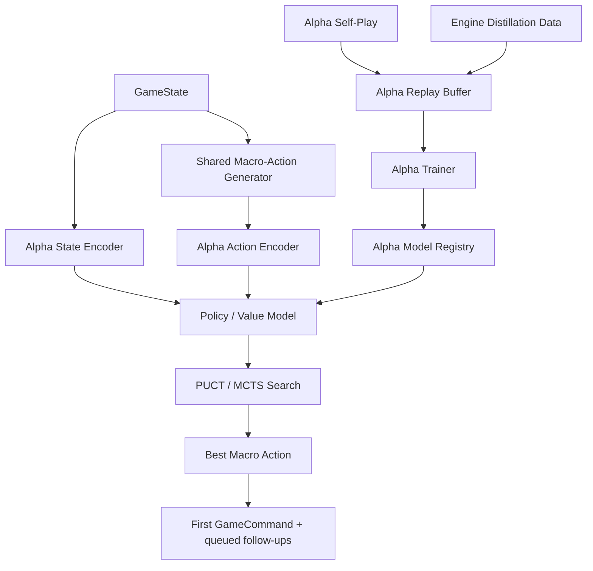

# Alpha Plan

Date: 2026-03-12  
Workspace: `/Users/kylebullock/HHv2`

## Purpose

This document defines a third AI family for `HHv2`:

- `Tactical` remains the heuristic AI.
- `Engine` remains the current Stockfish-style search + NNUE AI.
- `Alpha` is a new, fully separate transformer + PUCT/MCTS AI pipeline.

This plan is explicitly about adding `Alpha` without weakening, replacing, or destabilizing either `Tactical` or `Engine`.

## Non-Negotiable Isolation Rules

The `Alpha` pipeline must remain separate from the current `Engine` pipeline in every material way except for the shared game/rules runtime.

Required guarantees:

1. `Tactical` behavior must remain unchanged.
2. `Engine` behavior must remain unchanged.
3. Existing `nnue:selfplay`, `nnue:train`, and `nnue:gate` scripts must remain unchanged in behavior and artifact contract.
4. `Alpha` must have its own self-play, training, gate, model registry, model format, artifacts, and diagnostics.
5. The only shared surfaces are:
   - the game state
   - the legal command/rules engine
   - the existing AI controller strategy interface
   - player-selection plumbing in UI/headless/MCP
6. `Alpha` must be selectable as an additional AI tier, not as a replacement for `Engine`.
7. Any future acceleration, backend changes, or training experiments for `Alpha` must not change `Engine` artifacts or `Engine` scripts.

## Objective

Add a new `Alpha` AI tier that can:

- play against humans
- play against `Tactical`
- play against `Engine`
- play mirror matches against itself
- improve over time through its own training pipeline

The first implementation target is TypeScript-first for ease of integration and shared runtime use. Training backend changes can happen later, but the architectural contract must be defined now so future backend changes do not force runtime rewrites.

## What Alpha Is

`Alpha` is an AlphaZero-style sidecar AI, adapted to `HHv2`.

It is not a literal AlphaGo clone.

It combines:

- a compact entity transformer encoder
- a policy head over legal macro-actions
- a value head over the current game state
- PUCT/MCTS over the legal macro-action surface
- self-play and distillation training

This is the right adaptation because `HHv2` is not a clean fixed-grid board game. It has:

- continuous positions
- variable numbers of units and models
- terrain geometry
- mission/objective state
- phase/sub-phase flow
- reaction windows
- stochastic dice outcomes
- variable legal action counts

A literal board CNN is a poor fit. A giant transformer is too expensive for early runtime budgets. A compact entity transformer with action-conditioned policy scoring is the best first serious design.

## What Alpha Is Not

`Alpha` is not:

- a modification of the current `Engine` searcher
- a new NNUE model kind under the current `Engine` registry
- a rewrite of current tactical heuristics
- a second rules engine
- a Python-first mandatory dependency

The core design principle is:

- share game legality
- do not share search/training/model infrastructure

## Why Transformer + PUCT Instead of CNN + AlphaGo-Style Board Search

### Why not a board CNN

The game state is more naturally represented as entities than as a dense fixed board tensor. A board raster can be constructed later, but as a first-class architecture it creates avoidable problems:

- unit count varies
- units have discrete datasheet attributes not naturally captured by image planes
- legal actions are candidate lists, not board coordinates
- phases and reaction windows are symbolic and irregular
- many crucial features are relational rather than purely spatial

### Why a compact transformer

A compact entity transformer can model:

- friendly/enemy unit interactions
- objective pressure
- activation context
- threat relationships
- terrain context
- action-conditioned scoring

without forcing the game into a fake Go board.

### Why not a giant transformer

MCTS needs many evaluations. A large model would destroy throughput. The first `Alpha` runtime must fit real search budgets, so the model must remain compact.

## High-Level Architecture



## Shared Surfaces vs Separate Surfaces

### Shared surfaces

`Alpha` should reuse:

- `GameState`
- command legality and command processing
- battlefield geometry and unit data
- macro-action generation rules/legality surfaces
- headless match execution
- UI AI selection and dispatch points

### Separate surfaces

`Alpha` must own:

- `AlphaStrategy`
- `AlphaSearch`
- `AlphaModel`
- `AlphaModelRegistry`
- `alpha:selfplay`
- `alpha:train`
- `alpha:gate`
- `alpha:distill`
- its own self-play manifests/shards/replay buffers
- its own diagnostics types
- its own worker path if needed

## Runtime Placement in the Current Codebase

Minimal shared integration points:

- `packages/ai/src/types.ts`
  - add a new `AIStrategyTier.Alpha`
- `packages/ai/src/ai-controller.ts`
  - add strategy-factory support for `Alpha`
- `packages/ui/src/game/screens/ArmyLoadScreen.tsx`
  - expose `Alpha` as another AI choice
- `packages/ui/src/game/hooks/useAITurn.ts`
  - route `Alpha` through a dedicated worker path if search cost requires it
- `packages/headless`
  - allow `Alpha` player config selection
- `packages/mcp-server`
  - allow `Alpha` player config selection

Everything else should live in new `Alpha`-specific files and directories.

## Proposed Directory Layout

```text
packages/ai/src/
  alpha/
    strategy/
      alpha-strategy.ts
    search/
      alpha-search.ts
      puct.ts
      tree.ts
      expansion.ts
      chance-handling.ts
      policy-targets.ts
    model/
      alpha-model.ts
      alpha-model-registry.ts
      alpha-model-serialization.ts
      alpha-default-model.ts
      alpha-inference.ts
      alpha-feature-schema.ts
    encoding/
      state-encoder.ts
      action-encoder.ts
      token-builders.ts
      terrain-summary.ts
    training/
      replay-buffer.ts
      distillation-targets.ts
      alpha-trainer.ts
      alpha-dataset.ts
    diagnostics/
      alpha-diagnostics.ts
    tests/
      ...

tools/alpha/
  common.mjs
  self-play.mjs
  train.mjs
  gate.mjs
  distill-engine.mjs
  inspect-buffer.mjs
```

Artifact directories:

```text
tmp/alpha/
  selfplay/
  distill/
  train/
  gate/
models/alpha/
```

These names are intentionally distinct from `tools/nnue` and `tmp/nnue`.

## Theory of Operation

At each decision state:

1. Build the legal macro-action list.
2. Encode the current state into transformer tokens.
3. Encode each legal macro-action into action features.
4. Run the model to produce:
   - policy priors over legal macro-actions
   - a value estimate for the position
5. Run PUCT/MCTS to refine action choice.
6. Choose one macro-action from the search result.
7. Emit only the first public `GameCommand`; queue the rest in the same way the current AI controller already supports multi-command plans.

This keeps `Alpha` compatible with the current command-driven runtime.

## Search Space Definition

`Alpha` must search over the same macro-action surface concept that the current `Engine` uses.

Rationale:

- it keeps legality grounded in the real engine
- it preserves practical action abstraction
- it reduces branching factor relative to raw commands
- it allows fairer comparison against `Engine`

The `Alpha` candidate surface should initially reuse the current macro-action generator contract, then optionally fork later only if there is a clear need and explicit proof that divergence improves strength.

## State Representation

The state encoder should use entity tokens rather than a board CNN.

### Token families

1. global token
   - side to act
   - current phase
   - current sub-phase
   - battle turn
   - reaction ownership state
   - current VP totals

2. friendly unit tokens
   - unit profile / role embedding
   - centroid position
   - alive model count
   - wounds / hull / remaining strength
   - mobility state
   - objective-holder potential
   - tactical status flags

3. enemy unit tokens
   - same structure as friendly unit tokens

4. objective tokens
   - location
   - owner / contested status
   - scoring relevance

5. terrain summary tokens
   - terrain type
   - location / footprint summary
   - obstruction / cover relevance

6. optional special-state tokens
   - active challenge
   - pending reaction
   - active psychic effects
   - reserves / transport state summaries

### Representation rules

- token schema must be versioned independently from `Engine` NNUE features
- tokens must be active-player-relative where possible
- token counts must be bounded with stable sorting/truncation rules for determinism
- any truncation rules must be recorded in the model manifest

## Action Representation

Actions must be encoded as legal candidate macro-actions, not as an enormous fixed action vocabulary.

Each macro-action should include features such as:

- action family
  - move
  - rush
  - shoot
  - charge
  - reaction
  - psychic
  - challenge
  - aftermath
  - phase-end
- actor unit(s)
- target unit(s)
- movement distance / lane summary
- objective effect estimate
- threat / exposure deltas
- weapon selection summary
- whether the action is a continuation / follow-up

The policy head should score only the legal candidate set produced for the current state.

## Model Design

### Core model

Recommended first serious model:

- compact entity transformer
- 3 to 4 layers
- model width `128` to `192`
- `4` to `6` attention heads
- modest FFN width
- layer norm, residuals, dropout only if training proves it necessary

### Heads

1. policy head
   - scores the current legal macro-action set
   - outputs one logit per legal macro-action

2. value head
   - predicts scalar outcome estimate in `[-1, 1]`
   - optional auxiliary head for projected VP differential

### Policy scoring design

Recommended first design:

- state encoder produces contextual token embeddings
- pooled state embedding is concatenated with per-action features
- optional cross-attention from action embeddings into the state context
- final policy scorer emits logits only for current legal actions

This is cheaper and more practical than trying to decode over a global action vocabulary.

## Why This Can Compete With Engine

The goal is not to replace `Engine`'s style. The goal is to create a learning-first peer line.

The features that make `Alpha` potentially competitive are:

- policy priors that bias search toward stronger macro-actions
- value estimation that improves leaf evaluation
- training from the stronger current `Engine` as a teacher
- self-play refinement over time

The first serious `Alpha` version should not begin from scratch. It should begin from distillation.

## Distillation Bootstrap

Initial near-peer viability depends heavily on using the current `Engine` as a teacher.

### Distillation sources

1. current `Engine` self-play
2. current `Engine` vs `Tactical` games
3. shadow-mode `Engine` decision logs on curated positions

### Distillation targets

For each decision state record:

- serialized Alpha state tokens/features
- legal candidate macro-actions
- teacher chosen macro-action
- teacher search diagnostics
  - score
  - depth
  - nodes
  - principal variation
- final game outcome
- optional immediate tactical deltas

### Distillation phases

1. policy imitation
   - learn to match `Engine` selected macro-action
2. value warm-start
   - learn final outcome / score estimate
3. optional soft-target policy
   - if available, use teacher root score distribution instead of hard one-hot labels

This reduces the amount of pure self-play needed before `Alpha` becomes respectable.

## PUCT / MCTS Design

### Root search unit

Each root edge corresponds to one legal macro-action.

### Selection rule

Use standard PUCT-style scoring:

`score = Q(s,a) + c_puct * P(s,a) * sqrt(N(s)) / (1 + N(s,a))`

with:

- `Q(s,a)` from backed-up leaf evaluations
- `P(s,a)` from the policy head
- root Dirichlet noise only during self-play training, never during evaluation/gate

### Expansion

When expanding a decision node:

1. generate legal macro-actions
2. evaluate the node with the Alpha model
3. attach priors to each legal edge
4. initialize child visit/value stats

### Backup

Backup should propagate:

- value estimate
- terminal result if terminal
- player-relative sign handling

### Temperature

Self-play should use temperature at the root early in the game and decay later.

Evaluation/gate should use near-greedy or greedy action selection.

## Handling Stochasticity

`HHv2` includes dice and reaction windows. `Alpha` therefore cannot be a naive deterministic game-tree clone of Go.

### Required handling

Use explicit chance-aware search handling with deterministic reproducibility.

Recommended v1 approach:

- decision nodes for player choices
- sampled chance handling for dice outcomes
- explicit reaction decision nodes when the opponent must respond
- deterministic seed derivation per edge/sample for reproducibility

### Why sampled chance handling first

Full enumerated chance trees will explode quickly. Sampled chance handling is more practical for the first serious implementation.

### Determinism rule

Alpha search and tooling must define their own seed schedule, separate from `Engine`'s current search seed handling. Shared seed derivation code is acceptable only if the behavior is explicitly unchanged for `Engine`.

## Self-Play Pipeline

`Alpha` needs its own self-play runner and corpus format.

### alpha:selfplay

Responsibilities:

- run Alpha-vs-Alpha matches
- optionally run mixed `Alpha` vs `Engine` or `Alpha` vs `Tactical` curriculum matches
- record training tuples
- record replay artifacts
- shard large corpora
- emit Alpha-specific manifest files

### Training tuple contents

Each stored example should include:

- state representation
- legal candidate list
- policy target
  - visit counts or normalized visit distribution
- chosen action
- value target
  - final outcome
  - optional VP differential target
- metadata
  - battle turn
  - phase/sub-phase
  - matchup info
  - model version
  - search budget

### Replay buffer

Alpha should maintain its own replay buffer abstraction and retention policy, fully separate from the `nnue` pipeline.

## Training Pipeline

### alpha:distill-engine

This script prepares teacher-labeled data from the current `Engine`.

Responsibilities:

- run or ingest `Engine` decisions
- convert states/candidates to Alpha training examples
- produce Alpha-distillation manifests and shards

### alpha:train

This script trains the Alpha model.

Expected phases:

1. distillation pretrain from `Engine`
2. mixed distillation + self-play training
3. self-play dominant fine-tuning

### Loss design

Recommended initial loss:

- policy cross-entropy on teacher or visit distribution
- value loss on final outcome
- optional auxiliary VP regression
- entropy regularization if collapse appears
- weight decay / L2

### Model artifact design

Alpha artifacts must use a distinct schema, for example:

- `modelFamily: "alpha-transformer"`
- `schemaVersion`
- `tokenSchemaVersion`
- `actionSchemaVersion`
- `weightsChecksum`
- `trainingMetadata`

Do not reuse the current NNUE manifest or file contract.

## Gate / Evaluation Pipeline

### alpha:gate

This script benchmarks Alpha candidates.

Required matchup modes:

- Alpha vs Tactical
- Alpha vs Engine
- Alpha vs Alpha baseline

### Gate goals

1. strength tracking
2. regression detection
3. promotion decisions within the Alpha line only

### Important boundary

An Alpha promotion must never overwrite or mutate `Engine` artifacts. Promotion means:

- mark Alpha candidate as new Alpha default
- do not touch NNUE model registry or NNUE artifacts

## Runtime Selection and Matchups

After integration, the game should allow any player seat to choose:

- `Basic`
- `Tactical`
- `Engine`
- `Alpha`

Supported matchups:

- Human vs Alpha
- Tactical vs Alpha
- Engine vs Alpha
- Alpha vs Alpha
- Tactical vs Engine
- current existing pairings unchanged

This requires only shared config plumbing changes, not shared training/search code.

## Shadow Mode

Alpha should support an offline shadow mode before it is trusted as an active player.

Shadow mode behavior:

- live match still executes `Engine` or `Tactical`
- Alpha receives the same state and legal candidates
- Alpha logs what it would have chosen
- no command from Alpha is executed

This is the safest way to compare decision quality before full promotion.

## Worker and Runtime Strategy

Because Alpha search may be expensive, the UI should not run it on the main thread.

Recommended runtime path:

- dedicated Alpha worker type for browser use
- dedicated headless Alpha path for one-shot and session matches
- optional progress telemetry surface similar to `Engine`

Telemetry fields:

- elapsed time
- selected action
- root visits
- nodes expanded
- principal variation summary
- value estimate
- policy entropy

## Performance Targets

Initial targets for Alpha should be explicit:

- default UI budget compatible with playable turns
- no UI frame hitching
- determinism in headless runs at fixed seeds
- bounded memory use for tree and replay buffer

Suggested early runtime targets:

- normal UI budget: `400` to `800ms`
- heavy headless benchmark budget: `800` to `1500ms`

These are Alpha-specific knobs and must not alter current Engine defaults.

## TypeScript-First Constraint

The first implementation should be TypeScript-first.

Implications:

- runtime inference must work in TS
- search must work in TS
- self-play orchestration must work in TS
- model schema and serialization must be owned by this repo

Training can remain TS-first initially if feasible, but the architecture must allow future backend swaps without changing runtime contracts.

### Backend abstraction rule

Define Alpha model serialization and inference contracts independently from any specific trainer implementation.

That allows future migration to:

- a faster TS tensor path
- a Python trainer
- MLX
- Core ML export

without changing the gameplay/runtime integration layer.

## Testing and Verification

Alpha needs its own test surface.

### Unit tests

- model serialization round-trips
- token builder determinism
- action encoder determinism
- PUCT score correctness
- seed schedule determinism
- tree backup correctness

### Integration tests

- Alpha emits only legal commands
- Alpha queued plans obey the same invalidation expectations as current AI controller flow
- Alpha works in headless one-shot runner
- Alpha works in `HeadlessMatchSession`
- Alpha worker matches direct runtime decisions at fixed seeds

### Regression tests

- Alpha artifacts stay separate from NNUE artifacts
- Alpha scripts never write to `tmp/nnue`
- existing `nnue:*` behavior is unchanged
- `Engine` selected command sequence is unchanged after Alpha integration

## Implementation Phases

### Phase A - Isolation scaffolding

- add `AIStrategyTier.Alpha`
- add empty `AlphaStrategy`
- add Alpha-specific config and diagnostics types
- add UI/headless/player-selection plumbing
- add no-op shadow scaffolding

Exit criteria:

- `Alpha` is selectable
- `Tactical` and `Engine` behavior remains unchanged

### Phase B - Alpha model contract

- define Alpha model manifest
- define state token schema
- define action encoding schema
- define serialization/deserialization
- define default Alpha model artifact

Exit criteria:

- Alpha inference contract exists
- artifacts load independently of NNUE

### Phase C - Search core

- implement PUCT/MCTS
- connect shared macro-action generation
- connect chance handling
- emit commands through existing controller contract

Exit criteria:

- Alpha can play full legal games headlessly

### Phase D - Distillation pipeline

- implement `alpha:distill-engine`
- generate Engine-teacher corpora
- train initial policy/value model

Exit criteria:

- Alpha produces non-random decisions learned from Engine data

### Phase E - Alpha self-play

- implement `alpha:selfplay`
- implement replay buffer
- implement Alpha-only manifests/shards

Exit criteria:

- Alpha self-play runs complete cleanly

### Phase F - Gate and promotion

- implement `alpha:gate`
- benchmark against Tactical and Engine
- define Alpha-only promotion rules

Exit criteria:

- Alpha strength is measurable without touching Engine promotion flow

## Risks and Mitigations

### Risk: Alpha is too weak initially

Mitigation:

- bootstrap from Engine distillation
- reuse current macro-action abstraction
- keep model compact but expressive

### Risk: Alpha is too slow

Mitigation:

- compact transformer only
- candidate pruning from shared macro-action generation
- dedicated worker path
- explicit runtime budgets

### Risk: Alpha contaminates Engine pipeline

Mitigation:

- separate directories
- separate artifact schema
- separate scripts
- explicit regression tests that current `nnue:*` outputs/behavior are unchanged

### Risk: stochasticity breaks reproducibility

Mitigation:

- Alpha-specific deterministic seed schedule
- fixed reproducibility tests in headless and worker paths

## Acceptance Criteria

This blueprint is satisfied only when all of the following are true:

1. `Alpha` is selectable as a distinct AI tier.
2. `Tactical` remains unchanged.
3. `Engine` remains unchanged.
4. `nnue:selfplay`, `nnue:train`, and `nnue:gate` remain behaviorally unchanged.
5. `Alpha` owns its own model registry, scripts, manifests, and artifacts.
6. `Alpha` can complete headless games legally.
7. `Alpha` can run its own distillation, self-play, training, and gate loops.
8. Players can choose any pairing among `Tactical`, `Engine`, and `Alpha`.

## Final Recommendation

The correct path for `HHv2` is:

- keep the current `Engine` line intact as the Stockfish-style AI
- add `Alpha` as a separate transformer + PUCT/MCTS line
- bootstrap `Alpha` from `Engine`
- let both lines evolve independently

That gives the project two genuinely different long-term AI families:

- search + NNUE (`Engine`)
- policy/value + PUCT (`Alpha`)

with `Tactical` retained as the heuristic baseline and fallback.
