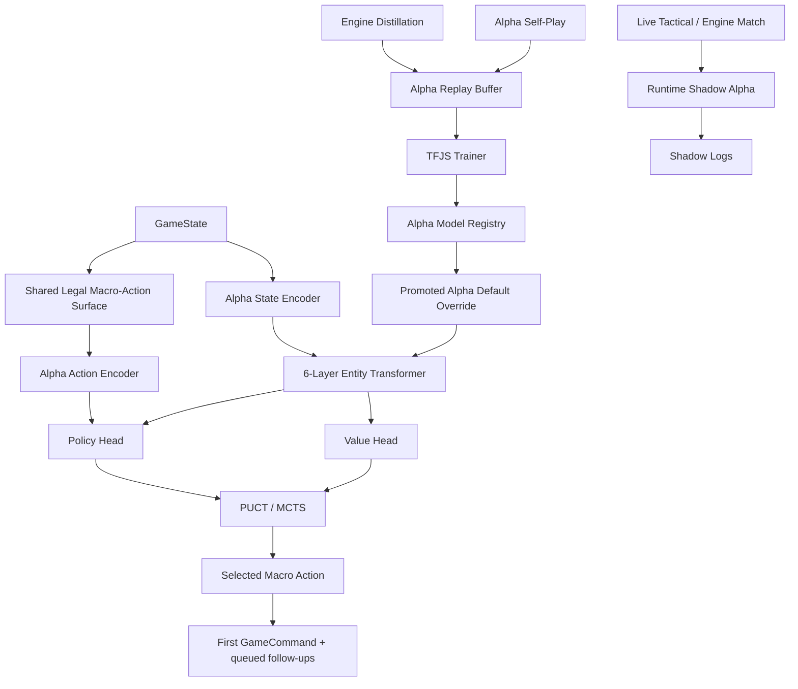

# Alpha Plan

Date: 2026-03-13  
Workspace: `/Users/kylebullock/HHv2`

## Standard

`Alpha` is not complete until the full transformer runtime, search, distillation, self-play, training, gate, promotion, and full runtime shadow-mode stack exists end to end.

This document is not a milestone scaffold, bootstrap sketch, placeholder architecture note, or partial rollout plan. It is the required implementation specification for a complete third AI family in `HHv2`.

The three AI families remain:

- `Basic`: random valid-action baseline
- `Tactical`: heuristic AI
- `Engine`: Stockfish-style search + NNUE AI
- `Alpha`: transformer policy/value + PUCT/MCTS AI

`Alpha` is additive. It does not replace, weaken, or rewrite `Tactical` or `Engine`.

## Verified Repo Baseline

This specification is aligned to the live repository state verified on 2026-03-13:

- `packages/ai/src/types.ts` currently exposes `Basic`, `Tactical`, and `Engine` only.
- `packages/ai/src/ai-controller.ts` is the current strategy-factory and queued-plan dispatch seam.
- `packages/ai/src/index.ts` is the public AI package export surface.
- `packages/ui/src/game/screens/ArmyLoadScreen.tsx` and `packages/ui/src/game/screens/ArmyBuilderScreen.tsx` both configure AI opponents today.
- `packages/ui/src/game/hooks/useAITurn.ts` routes `Engine` through `packages/ui/src/game/hooks/engine-ai.worker.ts`; `Basic` and `Tactical` run on the main thread.
- `packages/headless/src/index.ts`, `packages/headless/src/session.ts`, `packages/headless/src/decision-support.ts`, and `packages/headless/src/cli.ts` all participate in AI runtime selection.
- `packages/mcp-server/src/register-tools.ts` owns the schema-driven player configuration surface for match creation.
- `packages/mcp-server/src/match-manager.ts` is pass-through orchestration and should remain that way.
- Current default-model promotion for gameplay NNUE is archive-backed and code-generated through `tools/nnue/*` and `packages/ai/src/engine/default-gameplay-model-override.ts`.

`Alpha` must fit these live seams exactly unless the user explicitly requests a broader architectural rewrite.

## Non-Negotiable Isolation Rules

The following are hard requirements:

1. `Tactical` behavior remains byte-for-byte unchanged unless the user separately requests Tactical work.
2. `Engine` move selection, search behavior, evaluator behavior, worker behavior, and runtime defaults remain unchanged unless the user separately requests Engine work.
3. `nnue:selfplay`, `nnue:train`, `nnue:gate`, and `nnue:promote` remain unchanged in behavior, artifact contract, archive paths, and runtime ownership.
4. `Alpha` owns its own runtime, model format, self-play format, training data, gate data, promotion archives, diagnostics, and tooling.
5. `Alpha` may share only:
   - `GameState`
   - command legality and command processing
   - the existing legal macro-action surface produced from `generateMacroActions`
   - the AI controller / strategy dispatch seam
   - UI / headless / MCP seat-selection plumbing
6. `Alpha` must not write to:
   - `tmp/nnue`
   - `archive/nnue`
   - `packages/ai/src/engine/default-gameplay-model-override.ts`
   - any `Engine` model registry or NNUE artifact file
7. `Alpha` must be selectable as an additional AI tier, never as a replacement tier for `Engine`.
8. `Alpha` is rejected if its implementation changes `Tactical` or `Engine` behavior in any way beyond the additive integration points explicitly listed in this document.

## Definition Of Done

`Alpha` is only done when all of the following are simultaneously true:

1. A complete transformer policy/value model exists and runs in TypeScript at runtime.
2. `Alpha` can legally complete full games against humans, `Tactical`, `Engine`, and itself.
3. `Alpha` owns a complete distillation, self-play, training, gate, inspect, and promotion toolchain.
4. `Alpha` has a promoted default model that was actually trained and gated, not hand-authored or stubbed.
5. Full runtime shadow mode exists in UI, headless, and MCP without emitting Alpha commands.
6. Tactical, Engine, and all `nnue:*` flows remain unchanged.

There is no acceptable “partial Alpha” state described by this document.

## What Alpha Is

`Alpha` is a full AlphaZero-style sidecar AI adapted to `HHv2`:

- compact but serious entity transformer
- policy head over legal macro-actions
- value head over game outcomes
- PUCT/MCTS over the shared legal macro-action surface
- explicit handling for chance outcomes and reaction windows
- Engine-distilled warm start
- self-play improvement loop
- Alpha-only gate and promotion flow
- full runtime shadow mode

This is the correct AI family for `HHv2` because the game state is not a fixed-grid board. It includes:

- variable unit counts
- continuous positions
- terrain geometry
- mission and objective state
- irregular phases and sub-phases
- reaction windows
- dice-driven stochastic outcomes
- variable legal action counts

## What Alpha Is Not

`Alpha` is not:

- a modification of `packages/ai/src/engine/search.ts`
- a new NNUE model kind under the current Engine registry
- a rewrite of `Tactical`
- a second rules engine
- a placeholder tier
- a training-later runtime stub
- a dummy model with toy or handwritten weights
- a filesystem model registry under `models/alpha`

## Shared Surfaces vs Separate Surfaces

### Shared surfaces

`Alpha` reuses only:

- `GameState`
- command legality and command processing
- battlefield geometry and unit/objective/terrain state
- the legal macro-action surface produced by the current macro-action generator
- queued-plan emission through the current AI controller contract
- headless match execution and replay machinery
- UI, headless, and MCP player-selection plumbing

### Separate surfaces

`Alpha` owns:

- `AlphaStrategy`
- `AlphaSearch`
- `AlphaModel`
- `AlphaModelRegistry`
- `AlphaModelSerialization`
- `AlphaInference`
- `AlphaDiagnostics`
- `alpha:distill`
- `alpha:selfplay`
- `alpha:train`
- `alpha:gate`
- `alpha:promote`
- `alpha:inspect`
- Alpha-only temporary artifacts and archives
- Alpha-only shadow logs

## Runtime Placement In The Current Codebase

Minimal shared integration points:

- `packages/ai/src/types.ts`
  - add `AIStrategyTier.Alpha`
  - add `alphaModelId?: string`
  - add `shadowAlpha?: ShadowAlphaConfig | null`
  - convert `AIDiagnostics` from a flat shape into a tier-discriminated union
- `packages/ai/src/ai-controller.ts`
  - add strategy-factory support for `Alpha`
  - preserve current queued-plan semantics unchanged
- `packages/ai/src/index.ts`
  - export Alpha types, strategy, diagnostics, model, and tooling-facing helpers
- `packages/ui/src/game/screens/ArmyLoadScreen.tsx`
  - expose `Alpha` as a selectable AI tier
  - expose Alpha runtime budget presets
  - expose runtime shadow-mode controls
- `packages/ui/src/game/screens/ArmyBuilderScreen.tsx`
  - expose the same `Alpha` controls as `ArmyLoadScreen`
- `packages/ui/src/game/hooks/useAITurn.ts`
  - route `Engine` exactly as it works today
  - route `Alpha` through a dedicated Alpha worker
  - keep `Basic` and `Tactical` on the main thread
- `packages/ui/src/game/hooks/alpha-ai.worker.ts`
  - new dedicated Alpha worker
- `packages/ui/src/game/hooks/alpha-ai-worker.types.ts`
  - Alpha-specific worker request/response surface
- `packages/headless/src/index.ts`
  - support Alpha in the library-runner surface
- `packages/headless/src/session.ts`
  - support Alpha and shadow Alpha in session player configs and diagnostics
- `packages/headless/src/decision-support.ts`
  - continue exposing the shared legal macro-action surface while accepting Alpha player config fields
- `packages/headless/src/cli.ts`
  - accept Alpha as a tier
  - add Alpha model flags and shadow-mode flags
  - keep current Engine flags functioning unchanged
- `packages/mcp-server/src/register-tools.ts`
  - extend `playerConfigSchema` with Alpha and shadow-Alpha fields
- `packages/mcp-server/src/match-manager.ts`
  - remain additive pass-through only

All search, model, training, promotion, and shadow logging implementation beyond those seams belongs in Alpha-specific files.

## Repository Layout

The Alpha implementation lives in additive repo-owned paths only:

```text
packages/ai/src/
  alpha/
    strategy/
      alpha-strategy.ts
      alpha-strategy.test.ts
    search/
      alpha-search.ts
      alpha-search.test.ts
      puct.ts
      puct.test.ts
      tree.ts
      tree.test.ts
      chance-nodes.ts
      chance-nodes.test.ts
      root-reuse.ts
      root-reuse.test.ts
      seed-schedule.ts
      seed-schedule.test.ts
    model/
      alpha-model.ts
      alpha-model.test.ts
      model-registry.ts
      model-registry.test.ts
      serialization.ts
      serialization.test.ts
      inference.ts
      inference.test.ts
      default-model.ts
      default-model.test.ts
      default-alpha-model-override.ts
    encoding/
      state-encoder.ts
      state-encoder.test.ts
      action-encoder.ts
      action-encoder.test.ts
      token-builders.ts
      token-builders.test.ts
      terrain-summary.ts
      terrain-summary.test.ts
    training/
      replay-buffer.ts
      replay-buffer.test.ts
      distillation-targets.ts
      distillation-targets.test.ts
      trainer.ts
      trainer.test.ts
      dataset.ts
      dataset.test.ts
    diagnostics/
      diagnostics.ts
      diagnostics.test.ts

tools/alpha/
  common.mjs
  distill-engine.mjs
  self-play.mjs
  train.mjs
  gate.mjs
  promote-model.mjs
  inspect-buffer.mjs
```

Temporary artifacts and archives:

```text
tmp/alpha/
  distill/
  selfplay/
  train/
  gate/
  shadow/

archive/alpha/
  promotions/
```

There is no runtime `models/alpha/` registry in this plan.

## Public Type Changes

Alpha requires additive public-surface changes:

```ts
export interface ShadowAlphaConfig {
  enabled: boolean;
  alphaModelId?: string;
  timeBudgetMs?: number;
  baseSeed?: number;
  diagnosticsEnabled?: boolean;
}

export interface AIPlayerConfig {
  playerIndex: number;
  strategyTier: AIStrategyTier;
  deploymentFormation: AIDeploymentFormation;
  commandDelayMs: number;
  timeBudgetMs?: number;
  nnueModelId?: string;   // Engine only
  alphaModelId?: string;  // Alpha only
  baseSeed?: number;
  rolloutCount?: number;
  maxDepthSoft?: number;
  diagnosticsEnabled?: boolean;
  shadowAlpha?: ShadowAlphaConfig | null;
  enabled: boolean;
}
```

Diagnostics become a tier-discriminated union:

```ts
type AIDiagnostics = EngineAIDiagnostics | AlphaAIDiagnostics;
```

Requirements:

- `EngineAIDiagnostics` retains its current fields and semantics.
- `AlphaAIDiagnostics` adds:
  - `valueEstimate`
  - `rootVisits`
  - `nodesExpanded`
  - `policyEntropy`
  - `selectedMacroActionId`
  - `selectedMacroActionLabel`
  - `selectedCommandType`
  - `searchTimeMs`
  - `principalVariation`
  - `error`
- Headless and MCP surfaces must be able to surface either diagnostics shape without breaking existing Engine consumers.

## High-Level Architecture



## State Representation

The state encoder is entity-first and active-player-relative.

### Token families

1. Global token
   - side to act
   - current phase
   - current sub-phase
   - battle turn
   - first-player ownership
   - reaction ownership state
   - current VP totals
   - mission scoring context
   - pending decision kind

2. Unit tokens
   - unit profile / role / legion / allegiance embeddings
   - centroid position normalized to battlefield dimensions
   - facing summary
   - alive model count
   - wounds / hull points / remaining strength summary
   - morale, pinned, suppressed, stunned, routed, and other tactical-state flags
   - embarked / transport / reserve state
   - psychic capability and usage state
   - objective pressure summary
   - local cover / terrain relevance summary
   - incoming and outgoing threat summaries

3. Objective tokens
   - location
   - owner / contested state
   - VP value and current VP value
   - distance-to-friendly and distance-to-enemy summaries

4. Terrain tokens
   - terrain type
   - footprint summary
   - obstruction and cover relevance
   - proximity summaries to important units and objectives

5. Special-context tokens
   - active combat
   - active challenge
   - pending reaction
   - current psychic focus state
   - other decision-critical transient state

### Representation rules

- coordinates are normalized to battlefield width/height
- token ordering is deterministic
- token truncation is deterministic
- truncation order and limits are stored in the model manifest
- token schema version is independent from NNUE feature versioning

## Action Representation

The policy head scores only the legal macro-action set available at the current state.

Each macro-action embedding contains:

- action family
- actor IDs
- target IDs
- movement distance and lane summary
- weapon summary
- objective delta estimate
- exposure delta estimate
- continuation flag
- reaction metadata
- chance-sensitivity metadata

Policy scoring uses:

- pooled transformer state readout
- per-action embedding
- action-query cross-attention into the state memory
- one final logit per legal macro-action only

There is no global fixed action vocabulary in v1.

## Transformer Architecture

The required v1 architecture is:

- backend: TypeScript + `@tensorflow/tfjs`
- 6 transformer layers
- model width: `256`
- attention heads: `8`
- FFN width: `1024`
- pre-norm residual blocks
- learned token-type embeddings
- Fourier coordinate embeddings for positions
- dropout `0.1` during training
- dropout disabled in inference
- pooled global-token readout for value estimation

This is the minimum serious architecture for Alpha in this repo. It is not a placeholder.

## Policy And Value Heads

### Policy head

- scores the current legal macro-action set only
- uses action-query cross-attention against the state memory
- produces one logit per legal macro-action

### Value head

- scalar win value in `[-1, 1]`
- auxiliary VP differential regression
- auxiliary immediate tactical swing regression for training stability

## Model Artifact Contract

Alpha artifacts use a repo-owned schema separate from NNUE:

- `modelFamily: "alpha-transformer"`
- `schemaVersion`
- `tokenSchemaVersion`
- `actionSchemaVersion`
- `modelId`
- `weightsChecksum`
- `trainingMetadata`
- transformer hyperparameters
- base64-encoded Float32 tensor payloads

The promoted default Alpha model is loaded from:

- `packages/ai/src/alpha/model/default-model.ts`
- `packages/ai/src/alpha/model/default-alpha-model-override.ts`

The first promoted default Alpha model must be an actually trained distilled model that has passed Alpha’s own gate flow. No handwritten, empty, random, toy, or stub default model is acceptable.

## Search

Alpha search is full PUCT/MCTS over the shared legal macro-action surface.

### Required search behavior

- root edges correspond to legal macro-actions from the shared generator
- explicit decision nodes
- sampled chance nodes for dice-driven outcomes
- explicit reaction-response nodes
- deterministic seed schedule independent from Engine
- root Dirichlet noise during self-play only
- no Dirichlet noise in gate, evaluation, UI play, headless play, or shadow mode
- root reuse for repeated evaluations of unchanged states
- batched leaf evaluation in TFJS
- command emission through the existing queued-plan contract

### Selection rule

Use standard PUCT:

`score = Q(s,a) + c_puct * P(s,a) * sqrt(N(s)) / (1 + N(s,a))`

### Backup rules

Backup must propagate:

- player-relative signed value
- terminal result when reached
- sampled chance outcome value
- auxiliary value targets for diagnostics only, not search replacement

## Runtime Search Defaults

Required Alpha runtime presets:

- UI Balanced: `600ms` or `256` simulations, whichever comes first
- UI Tournament: `1500ms` or `640` simulations, whichever comes first
- headless default: `1500ms` or `640` simulations
- self-play default: `800` simulations with temperature and Dirichlet noise enabled

These are Alpha-only controls. They must not alter current Engine defaults.

## Distillation, Self-Play, Training, Gate, And Promotion

### `alpha:distill`

Responsibilities:

- ingest Engine self-play states
- ingest Engine vs Tactical games
- ingest runtime shadow logs
- convert those states into Alpha training tuples
- produce Alpha-only distillation manifests and shards under `tmp/alpha/distill`

### `alpha:selfplay`

Responsibilities:

- run Alpha vs Alpha matches
- run curriculum matches vs Tactical and Engine
- record policy targets from visit distributions
- record value targets and auxiliary targets
- emit replay artifacts and manifests under `tmp/alpha/selfplay`

### `alpha:train`

Responsibilities:

- train with TFJS
- use policy loss, value loss, VP differential loss, tactical swing loss, entropy regularization, and weight decay
- emit Alpha candidate model artifacts and training summaries under `tmp/alpha/train`

### `alpha:gate`

Responsibilities:

- benchmark Alpha candidate vs Tactical
- benchmark Alpha candidate vs Engine
- benchmark Alpha candidate vs current Alpha default
- write summaries under `tmp/alpha/gate`
- decide promotion eligibility within the Alpha line only

### `alpha:promote`

Responsibilities:

- archive the promoted candidate and gate summary under `archive/alpha/promotions`
- generate `packages/ai/src/alpha/model/default-alpha-model-override.ts`
- update Alpha-only promotion metadata
- never modify any `nnue` file, archive, override, or registry

### `alpha:inspect`

Responsibilities:

- inspect replay buffers
- inspect distillation manifests
- inspect training summaries and gate summaries

## Runtime, UI, Headless, MCP, And Shadow Mode

### UI runtime

Required UI behavior:

- `ArmyLoadScreen` and `ArmyBuilderScreen` both expose `Alpha`
- both screens expose Alpha model selection and Alpha budget presets
- both screens expose shadow-mode controls
- live seat can be `Tactical` or `Engine` while `shadowAlpha` runs sidecar inference
- shadow Alpha never emits commands

### Worker runtime

Required worker behavior:

- `Engine` keeps its current worker path unchanged
- `Alpha` gets a dedicated worker beside the Engine worker
- `useAITurn` dispatch rules become:
  - `Engine` -> current Engine worker
  - `Alpha` -> Alpha worker
  - `Basic` / `Tactical` -> main thread

### Headless runtime

Required headless behavior:

- Alpha is supported in:
  - library runner
  - match session
  - decision-support snapshots
  - CLI parsing and help text
- add Alpha-specific CLI model flags rather than overloading NNUE model ownership
- shadow Alpha is supported in headless sessions and reflected in diagnostics/output artifacts

### MCP runtime

Required MCP behavior:

- `playerConfigSchema` accepts `Alpha`
- `playerConfigSchema` accepts `alphaModelId`
- `playerConfigSchema` accepts `shadowAlpha`
- match-manager remains additive pass-through only

## Testing And Verification

### Documentation verification

- every file path named in this document must exist in the repo or be an additive file called for by this implementation spec
- every live-repo claim in this document must match the repo state verified on 2026-03-13

### Runtime regression

- keep `pnpm typecheck` green
- keep existing AI/headless/MCP tests green
- add golden Engine regression tests proving Alpha integration does not change Engine selected commands on fixed seeds and curated states
- add Tactical regression tests proving unchanged decisions on curated states

### Alpha tests

- serialization round-trip
- token determinism
- action-encoder determinism
- PUCT selection correctness
- tree backup correctness
- chance-node seed determinism
- worker vs direct-runtime parity
- legal full-game headless Alpha mirrors
- MCP Alpha match creation and AI advancement
- runtime shadow-mode logging with zero Alpha command emission
- tool tests for `alpha:distill`, `alpha:selfplay`, `alpha:train`, `alpha:gate`, and `alpha:promote`

### Artifact isolation

- assert Alpha scripts only write under `tmp/alpha` and `archive/alpha`
- assert Alpha promotion only updates Alpha override files and Alpha archives
- assert `nnue:*` artifacts and archive paths are untouched

## Package Scripts

Root `package.json` must add:

- `alpha:distill`
- `alpha:selfplay`
- `alpha:train`
- `alpha:gate`
- `alpha:promote`
- `alpha:inspect`

Each script uses the existing ESM loader pattern already used by `tools/nnue/*`.

## Completion Standard

Work order may be staged internally for engineering convenience, but Alpha is not considered implemented until every required workstream in this document is complete.

There is no acceptable intermediate state where:

- `Alpha` is selectable but untrained
- `Alpha` has a dummy default model
- `Alpha` can search but cannot train
- `Alpha` can train but cannot gate
- `Alpha` can gate but cannot promote
- `Alpha` lacks full runtime shadow mode

## Hard Acceptance Statement

This plan is satisfied only when:

1. `Alpha` exists as a full transformer + PUCT/MCTS AI family with complete runtime, training, gate, promotion, and shadow-mode support.
2. The first promoted default Alpha model is a trained distilled model, not a stub.
3. `Tactical` behavior remains unchanged.
4. `Engine` behavior remains unchanged.
5. `nnue:selfplay`, `nnue:train`, `nnue:gate`, and `nnue:promote` remain unchanged.
6. Alpha tooling writes only to Alpha-owned artifact paths.
7. Alpha promotion modifies only Alpha-owned promotion paths.
8. Alpha is rejected if it interferes with Tactical or Engine in any way.
